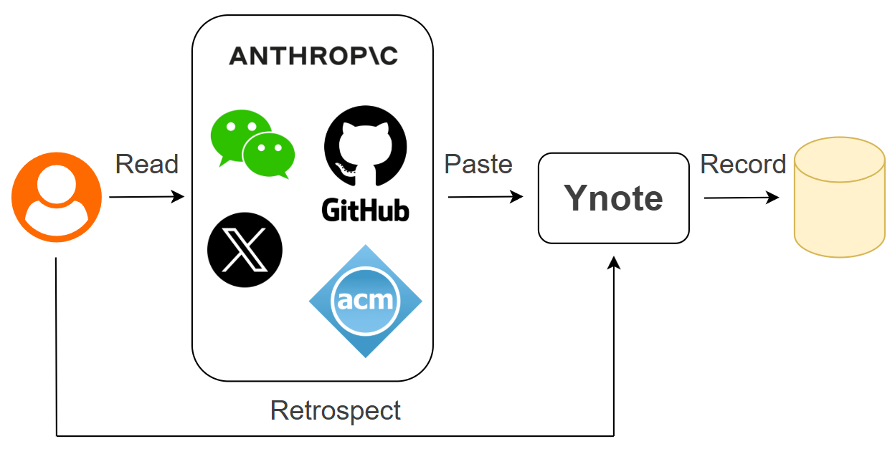

# YNote — A Lightweight Note-Taking Plugin for Learners

## Why I Build YNote

Researchers track the progress of their peers through literature review, and literature management tools have emerged as a targeted solution to systematically address the needs of collecting, organizing, and retrieving academic literature. For modern developers — especially those working in the artificial intelligence (AI) field — they routinely obtain fragmented updates on cutting-edge industry trends, technical solutions, and open-source project information through multiple channels, including official announcements, WeChat Official Account articles, technical blogs, X (formerly Twitter), and GitHub repositories. Currently, commercial note-taking tools like Notion and Obsidian are commonly used to take notes. However, the free version of these tools typically are designed for general-purpose note-taking and too heavyweight. In the era of agent-coding, we can build a lightweight note-taking plugin easily with the help of large language models (LLMs) and open-source libraries. Therefore, I built YNote to provide me with a dedicated information management tool that is lightweight and tailored to my usage habits.

YNote is built as a VS Code extension. Just Paste a URL, auto-extract metadata (title, author, organization, abstract), and store it in a github private repo as a reading record. 



## Features

- **Add Reading**: Paste a URL (`Ctrl+Shift+Y`) — auto-extracts title, author, organization, and abstract
- **Sidebar Tree View**: Browse readings sorted newest-first, expand for details
- **Webview Dashboard**: Card-based view with search and filter
- **GitHub Sync**: Manually sync your readings to a private GitHub repo for cross-device access
- **Cross-Platform**: Works on Linux (native and WSL) and Windows

## Installation

### Option A: Install from .vsix (recommended)

1. Download the latest `ynote-x.x.x.vsix` from the [Releases](https://github.com/yanfeit/ynote/releases) page
2. In VS Code, open the **Extensions** sidebar (`Ctrl+Shift+X`)
3. Click the **`...`** menu at the top-right of the Extensions panel
4. Select **Install from VSIX...**
5. Choose the downloaded `.vsix` file
6. Click **Reload Window** when prompted

### Option B: Install from .vsix via command line

```bash
code --install-extension ynote-x.x.x.vsix
```
Then reload VS Code (`Ctrl+Shift+P` → **Reload Window**).

### Option C: Build from source

```bash
git clone https://github.com/yanfeit/ynote.git
cd ynote
npm install
npm run compile
npx @vscode/vsce package
code --install-extension ynote-*.vsix
```

### Remote SSH / WSL

YNote works in Remote SSH and WSL environments. When connected to a remote machine, install the `.vsix` using the same methods above — VS Code will place it in the remote extension host automatically.

## Usage

1. Press `Ctrl+Shift+Y` or run **YNote: Add Reading from URL** from the command palette
2. Paste a URL (blog post, article, news)
3. The extension fetches metadata and saves the reading
4. Browse in the **YNote** sidebar or open the **Dashboard** via command palette

### Commands

| Command | Keybinding | Description |
|---------|------------|-------------|
| YNote: Add Reading from URL | `Ctrl+Shift+Y` | Paste URL, extract metadata, save |
| YNote: Remove Reading | — | Remove selected reading (sidebar context menu) |
| YNote: Open in Browser | — | Open URL in browser (sidebar context menu) |
| YNote: Show Dashboard | — | Open webview dashboard with search |
| YNote: Sync to GitHub | — | Commit and push to GitHub |
| YNote: Refresh Readings | — | Refresh sidebar tree view |

## GitHub Sync Setup

1. Create a private GitHub repository (e.g., `ynote-data`)
2. Open VS Code Settings → search "ynote"
3. Set `ynote.githubRepoUrl` to your repo URL (e.g., `git@github.com:yourusername/ynote-data.git`)
4. Run **YNote: Sync to GitHub** to push/pull readings

Requires git installed and authenticated (SSH key or credential helper).

## Configuration

| Setting | Default | Description |
|---------|---------|-------------|
| `ynote.githubRepoUrl` | `""` | Private GitHub repo URL |
| `ynote.maxAbstractLength` | `500` | Max extracted abstract length |
| `ynote.fallbackDescriptionLength` | `100` | Fallback description length |
| `ynote.fetchTimeout` | `10000` | HTTP fetch timeout (ms) |

## Data Storage

Your readings are stored locally in a JSON file at VS Code's global storage path:
- **Linux / WSL**: `~/.config/Code/User/globalStorage/yanfeit.ynote/readings.json`
- **Remote SSH**: `~/.vscode-server/data/User/globalStorage/yanfeit.ynote/readings.json`
- **Windows**: `%APPDATA%\Code\User\globalStorage\yanfeit.ynote\readings.json`

## Development

```bash
npm run compile   # Build
npm run watch     # Watch mode
npm run lint      # Type-check
npm test          # Run unit tests
```

Press `F5` in VS Code to launch the Extension Development Host for live testing.

## License

ISC
